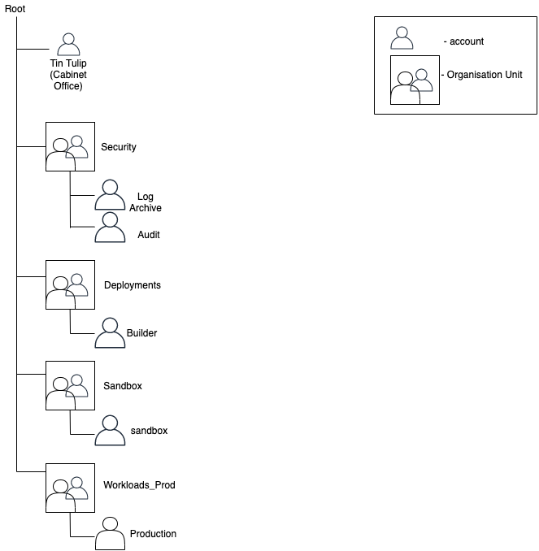

# Account Structure

As part of scenario 1, two new accounts have been added to the default [accounts](https://docs.aws.amazon.com/controltower/latest/userguide/how-control-tower-works.html) in our case log-archive, audit, production and root accounts.

The current account structure is represented in the diagram below.

## Builder Account

Builder account is owned by the governance team, and is a highly secure environment for deploying infrastructure into production environment. No other team should have admin access to the account, but all can still view the account. 

AWS basic organisation [template]("https://docs.aws.amazon.com/whitepapers/latest/organizing-your-aws-environment/basic-organization.html") recommends `CI/CD` as a seperate function which includes a `deployment OU`, this represents our `Builder OU`. 

## Sandbox Account

Sandbox account is owned by team Dali, and is a test environment for platform teams to test infrastructure changes before they are released to production. Resources withing this environment are expect to be regularly destroyed.

