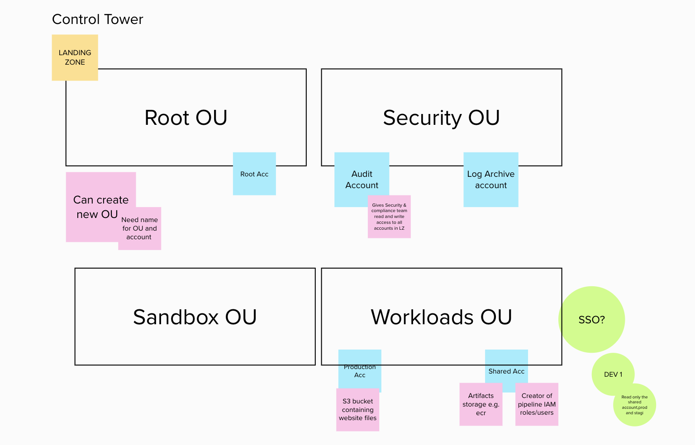

# AWS Control Tower

Reference links:
- [User Guide](https://docs.aws.amazon.com/controltower/latest/userguide/what-is-control-tower.html)

## Root credentials for LZ generated accounts

Accounts generated by the Landing Zone (Audit and Log Archive) are tied to two email addresses chosen at setup time.
As per [documentation (section "Sign in with the root user")](https://docs.aws.amazon.com/controltower/latest/userguide/best-practices.html), the owner of these email accounts will have the ability of password-reset the `root` identity for these two accounts.

Knowing this, when planning a Control Tower setup it would be important to know who will be in possession of these accounts and plan security controls accordingly.

## Setting up landing zone
In order for a landing zone to be configured, control tower runs pre-launch checks on your account. To set up a landing zone, we followed the [getting started](https://docs.aws.amazon.com/controltower/latest/userguide/getting-started-with-control-tower.html) instructions. Control tower created two organisational units(ou), `security` and `sandbox` and within `security ou` created two accounts:`log archive` and `audit account`. To create the accounts, control tower required two distinct, unique email addresses that were not associted with an AWS account. Required to pick a region in the Region selection during set up.

## Region

Currently Control Tower governs and controls London (eu-west-2) and Ireland (eu-west-1). London has been set up as the `home region` and cannot be changed without the assistance of AWS Support. To enable further regions, we can set up a further landing zone from within the AWS Control Tower management account. AWS Control Tower will automate the creation of new landing zones.

## Guardrails

Control tower implements preventative or detective controls through guardrails and is applied throughtout the entire organisational unit. When control tower is set up guardrails is automatically enabled and certain controls are mandatory or elective.

## GuardDuty
When AWS Control Tower is initially enabled, it does not activate GuardDuty by default for the management account nor any other account created. For GuardDuty to be enabled for all accounts, a single account must be selected to be the administrator account (typically the Audit account). Other AWS accounts can then be associated with this GuardDuty administrator account as member accounts. As all accounts created through Control Tower are part of an AWS Organization, the account selected becomes the organization's delegated administrator for GuardDuty.

For enabling GuardDuty programmatically, the repository [enabling-guardduty](https://github.com/tintulip/enable-guardduty) provides Infrastructure-as-code to do so. It is recommended to do so after running `AWS Control Tower` and before creating any other accounts as future accounts will then have GuardDuty enabled automatically.

### Enable GuardDuty on multiple regions
GuardDuty is currently enabled for just two regions (London & Ireland). It is best-practice to enable GuardDuty for all regions. To protect ourselves, we restricted other enabled regions by blocking service usage but for London and Ireland. To enable GuardDuty in another region, the region should be added as a module on the following [repository](https://github.com/tintulip/enable-guardduty/blob/main/README.md#multiple-region-support).

## Service Control Policies (SCPs)

Enabling `Service Control Policies` brings great benefits. The policies are similar to IAM policies, with a few extra restrictions. The policies are applied to `Organizational Units` and apply to AWS accounts that are included within the `Organizational Units`. When new accounts are created through Control Tower, the accounts are added to an Organization Unit and will have default restrictions placed upon them depending on the use case.

SCPs can be managed using infrastructure-as-code to help keep track of what is applied and to make changes incrementally. The repository [service-control-policies](https://github.com/tintulip/service-control-policies) keeps track of SCPs applied.

## Current Organisation Units Structure
Below is a diagram that represents the organisation units(ou) Control tower has set up as well as an additional ou we have made, workloads OU. It also includes what each `ou` can do which is represented by the pink stickies and the following accounts.

## Out of the box SSO permissions

The setup comes with a group named `AWSSecurityAuditors`. This is a rather confusing naming as the permissions associated with it are `AWSReadOnlyAccess` that are more limited than what the AWS-managed `SecurityAudit` policy grants.
- :warning: In particular, these permissions are not enough to run a ScoutSuite report on an account.
- :warning: Similarly, users in this group have no ability to see security audit dashboards like Config or GuardDuty.
