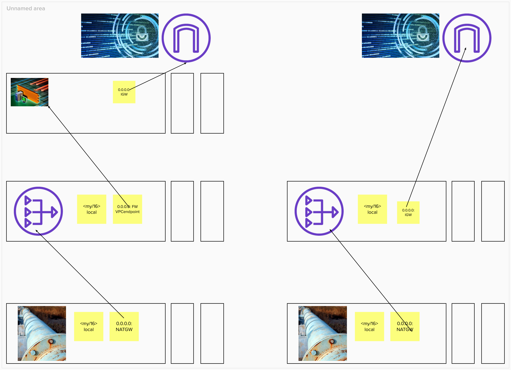

# Network Firewall

A network firewall permits or blocks traffic to the `VPCs` you want to protect. [AWS Network Firewall](https://docs.aws.amazon.com/network-firewall/latest/developerguide/getting-started.html) uses a `RuleGroup` that is referenced in the `FirewallPolicy` which is matched against the traffic leaving the `VPC`. The rules can contain `domain lists` and `IP rules` that determine which packets are allowed or denied into the `VPC`. The network firewall uses both `stateless` and `stateful` rule group types that determine how the packets are inspected. A stateless rule group inspects the packet on its own with no additional context whilst stateful packets are inspected depending on the context of the traffic flow and of other traffic that is related to that packet.

## Benefits
Using AWS Network Firewall has many benefits. For instance, provides network protection as traffic is evaluated based on a packet by packet basis. This protection is achieved by defining network firewall rules based on IP, port, protocol and domain. Also, as network firewall is managed by `AWS`, depending on the network traffic the network firewall automatically scales up.

## Rules Added
The rules added to the network firewall in the builder account are:
### Drop non http traffic.
This rule blocks `tcp` traffic that is not `http` and all `non-tcp` traffic.
### The domains that are denied into the VPC.
- `gists` from `GitHub`
### The domains that are allowed into the VPC.
- Java packages from `Gradle` and `Maven`
- Binaries from `GitHub` and `HashiCorp`
- Terraform modules from the registry
- Docker images
- `AWS` api calls

## Architecture
The diagram below shows the changes made to the route table in the builder account. The left hand side contains VPC endpoint from the network firewall and the right hand side represents before adding a network firewall.

### Route Tables
Originally the route table associated with the public subnets sent the traffic to the internet gateway. However, this route was modified to send traffic to the VPC endpoint that resides in the firewall subnet. Additionally, a new route table that is explicitly associated with the firewall subnets was created and sent traffic to the internet gateway instead. Finally, a route table with an edge association with the internet gateway and the destination being the public subnet that the NAT gateway resided in.

### Subnets
A subnet is created which will contain the network firewall vpc endpoints. These subnets are for the exclusive use of the network firewall as a firewall endpoint can not filter traffic coming into or out of the subnet in which it resides.

### VPC endpoints
VPC endpoints are created for each firewall subnet referenced. These are used as the target in the route table association with the internet gateway where the destination is the public subnets. They are also used as the target in the public route table(route table associated with public subnets) where the destination is the `0.0.0.0/0`.

## Future Considerations

When using AWS Network Firewall, there are some considerations to take into place. Originally, a [terraform module for VPC](https://registry.terraform.io/modules/terraform-aws-modules/vpc/aws/latest) was used. However, this needed to be adapted due to the additional subnets required for the firewall as well as the modifications required for the routes. The internet gateway was originally created by the module but as it is referenced in the route table, it would be created outside of the module.

### High Availability

Currently, the firewall subnet lives in a `single availability zone` and is subject to downtime if that availability zone goes down. Adding multiple firewall subnets across availability zones is trivial. However, it will mean that there are multiple VPC endpoints created - one for each subnet. These `VPC endpoints` will need to be added to the route table with an edge association with the `Internet Gateway` where the destination is each public subnet tier in which a `NAT gateway` lives. Currently there is a single NAT gateway which lives in a single availability zone, however that can be expanded to have one in each public subnet. Each public subnet can then have its own route table that will target the VPC endpoint in its own availability zone when sending traffic to `0.0.0.0/0`.

### Target Domains

The current rule set have both an `allowlist` and a `denylist`. The allowlist lists the domains that contain binaries and packages required for a successful build and are very specific to those requirements. Some of those domains could be removed with the assets being proxied from elsewhere. Likewise, if other external websites are used for binaries or packages, then they must be added to the allowlist.