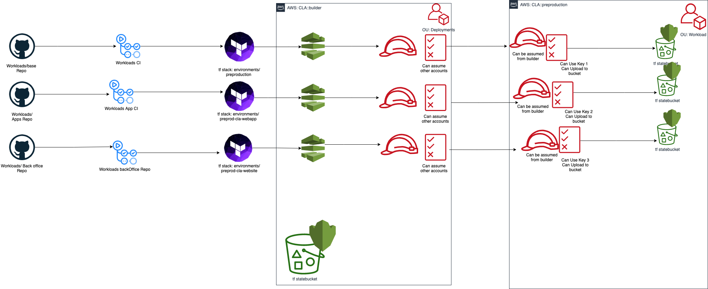

# State Buckets

Each environment has a state file that contains the infrastructure created. This means that in order to make changes to the infrastructure the person who is making the change needs access to the state file therefore, the state file should be stored in a shared location. Terraform provides a way to store the state file on a remote backend in a `S3 bucket`. Also, the data in terraform state files are stored in plain text, this means that if a malicous user is able to gain access to the state file they would be able to see the secrets that are used by the resources.    

## Architecture

In the diagram below each environment corresponds to a stack which has a state file and each state file is in its own state bucket. Therefore, each stack has its own state bucket. 

The current kms state bucket structure is represented in the diagram below.

## Encrypting State Buckets

Amazon S3 uses an individual AWS KMS key for each [bucket](), therefore if all the state files were stored in one `S3 bucket` , it would be encrypted by one kms key. Therefore, if a malicious user gained access to the `kms key` they would be able to decrypt the state files and see all the secrets. Whereas,having the state files in a seperate state buckets reduces the blast radius and prevents all state files from being decrypted.  