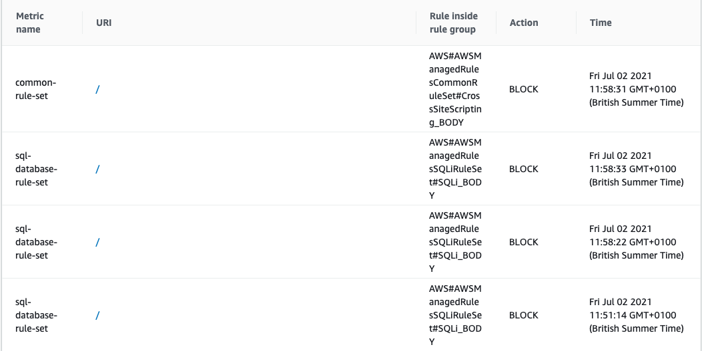

# Web Application Firewall (WAF)

[AWS web application firewall](https://aws.amazon.com/waf/) helps to protect web applications or APIs against common web exploits by creating security rules that can block common attack patterns. It will typically protect web applications against attacks such as cross-site forgery and SQL injections as well as others. A WAF can act as either a blocklist or allowlist. A blocklist WAF denies traffic that match against a set of rules where as an allowlist only admits traffic that has been pre-approved.

## Benefits

By using [AWS Managed Rules](https://docs.aws.amazon.com/waf/latest/developerguide/aws-managed-rule-groups-list.html) and rule propagation taking under a minute, it is quick to enforce security measures. As AWS WAF can inspect web requests with minimal latency, there is minimal impact to incoming traffic. The rules in place can be very specific to the type of applications that are running within the workloads.

Some of the managed rules chosen are:

- Core rule set (CRS)
- Known bad inputs
- SQL database
- Linux operating system
- POSIX operating system

## How it works

A WAF operates through a set of rules which aim to protect against vulnerabilities in the appliction by filtering out malicious traffic. The value comes from the speed and ease at which a WAF and its policies can be applied to a loadbalancer, API gateway or other AWS services and from the fact that (managed) rules can be updated to protect against emerging threats.

## Examples in Use

To test that these rules were working, several requests can be sent to test it out.

A "good" request allowed
```bash
export TINTULIP_URL=https://waf.tintulip-scenario1.net
curl -X GET $TINTULIP_URL
<!DOCTYPE html>
<html>
<body>

<h1>CLA Website</h1>


<a href="addUser" >
    add user.
</a>

</body>
</html>
```

A request blocked with cross-site scripting
```bash
export TINTULIP_URL=https://waf.tintulip-scenario1.net
curl -X POST $TINTULIP_URL -F "user='<script><alert>Hello></alert></script>'"
<html>
<head><title>403 Forbidden</title></head>
<body>
<center><h1>403 Forbidden</h1></center>
</body>
</html>
```

A request blocked with SQL Injection
```bash
export TINTULIP_URL=https://waf.tintulip-scenario1.net
curl -X POST $TINTULIP_URL -F "user='AND 1=1;"
<html>
<head><title>403 Forbidden</title></head>
<body>
<center><h1>403 Forbidden</h1></center>
</body>
</html>
```

Findings can be found on the AWS WAF console as well as logs.
